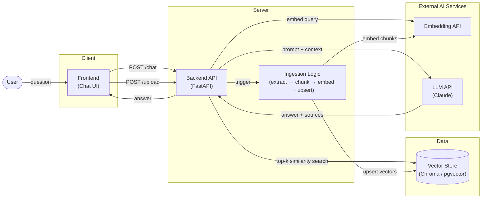

# Life DLC

> You already know how to live — you've just been playing on the "Taiwan" map. Moving to the US is like a game where all your skills carry over, but a whole new region unlocks: different systems, different rules, no manual. Like downloading a DLC on top of a game you already own, **Life DLC** is the "Living in the US" content pack for the life you already know — a personal web app that helps an international student actually _manage_ it instead of dreading it.

## Why

As a student from Taiwan moving to the US, everyday life here turns out to be genuinely hard — across a huge range:

- **Small:** which US grocery item can stand in for a Taiwanese ingredient?
- **Medium:** opening a bank account, figuring out if I can actually go see a doctor.
- **Large:** insurance claim procedures, and the school policies tied to my studies.

Each of these lives in a different place, in unfamiliar terms, with real consequences for getting it wrong. I don't want to spend every day anxious about _when tuition is due_ or _whether I'm covered for a clinic visit_. Life DLC is where all of that gets managed in one place.

## Modules

Life DLC grows one module at a time — each hard part of study-abroad life becomes its own module.

- **Chat** _(first module)_ — ask questions about your own documents (insurance, school policy, …) and get answers in plain language, **with citations**.
- _Planned:_ budgeting / bill tracking, calendar & to-dos (tuition deadlines, appointments), more document sources.

---

## Chat

The problem: the answers you need are buried in dense PDFs — insurance plans, department credit rules, visa paperwork — written in language that's hard to parse and costly to misread.

Chat lets you **connect those private documents to an LLM and ask in natural language**. It retrieves the relevant passages from _your_ documents, generates an answer, and **always shows its sources** so you can verify — which matters a lot when the topic is a claim or a policy.

📄 Full design (API, ingestion, data model, principles): [`docs/chat.md`](docs/chat.md)

### System Component Diagram

